Aayush Kumar

<html>
<head>
<title>Recognition with Bag of Words</title>
<link href='http://fonts.googleapis.com/css?family=Nunito:300|Crimson+Text|Droid+Sans+Mono' rel='stylesheet' type='text/css'>
<link rel="stylesheet" title="Default" href="styles/github.css">

<link rel="stylesheet" href="html/highlighting/styles/default.css">

</head>
<body>

<h1>Aayush Kumar</h1>

<h2>Project 4 / Scene Recognition with Bag of Words</h2>

 	This project focused on extrapolating the subject labels of images using bags of images. Apart from the original project requirements, I did the following extra credit:

<ol>
<li>Used a Gaussian Pyramid Blur Image before vectorizing feature at sigma = 0.25</li>
<li>Implemented k=10 nearest neighbors instead of nearest neighbor</li>
<li>Experimented with many different vocabulary sizes and report performance. E.g. 10, 20, 50, 100, 200, 400, 1000, 10000..</li>
<!-- 200 = 66.1, 10 = 41.5,  -->
<li>etc.</li>
</ol>

 I found this project to be a really cool application of the NLP concept of Bag of Words, something that I didn't realize could be applied to sift features and image interest points. Below are my results and optimal parameters.
Algorithmically I followed the instructions mostly, choosing to do things slightly differently with k nearest neighbors instead of the absolute nearest neighbor as well as applying a Gaussian filter before processing my images.

<h2>Tiny Images/Bags of Sift with Nearest Neighbor/1 vs all SVM</h2>

<h3>
Nearest Neighbor:
</h3>

Tiny Image: 0.194

Bag of Sift: 0.423

<h3>
1 vs all SVM:
</h3>

Tiny Image: 0.127

Bag of Sift: 0.661

<h2>Paramter Optimization</h2>
Below are the parameters I tweaked to achieve optimal results

<pre><code>
%Gaussian Pyramid
im = imgaussfilt(im, 0.25);

%SVM Lambda value
lambda = 0.0001;
% 10 =>
% 1 =>
% 0.1 => 0.485
% 0.01 => 0.517
% 0.001 => 0.625
% 0.0001 => 0.622
% 0.00001 => 0.583
% 0.000001 => 0.544

%Vocabulary Size (See table below for confusion matrices)
vocab_size = 200
% 10: Accuracy (mean of diagonal of confusion matrix) is 0.421
% 50: Accuracy (mean of diagonal of confusion matrix) is 0.594
% 100: Accuracy (mean of diagonal of confusion matrix) is 0.623
% 200: Accuracy (mean of diagonal of confusion matrix) is 0.661
% 400: Accuracy (mean of diagonal of confusion matrix) is 0.629
% 1000: Accuracy (mean of diagonal of confusion matrix) is 0.652
% 10000: Accuracy (mean of diagonal of confusion matrix) is 0.686
</code></pre>

<h3>Results in a table</h3>

<table border=0>
<tr>
Vocab Sizes: 10, 50, 100, 1000, 10000
<td>
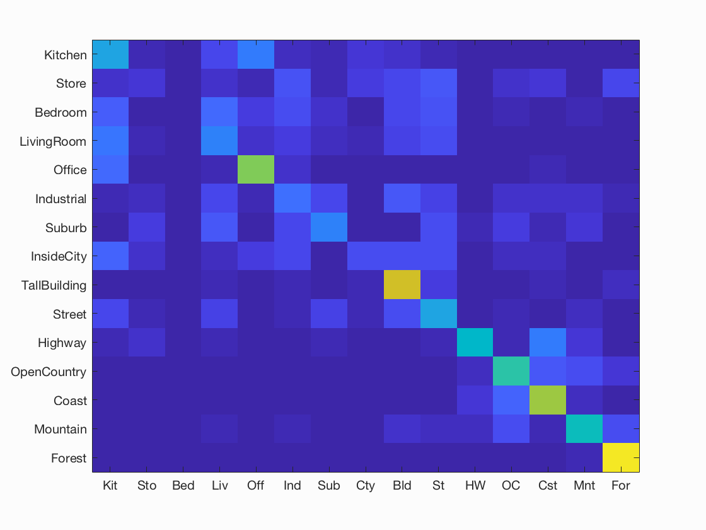

</td>

</tr>
<tr>
<td>

</td>
</tr>

</table>

<h1>Scene classification results visualization</h1>

 
Accuracy (mean of diagonal of confusion matrix) is 0.661

<table border=0 cellpadding=4 cellspacing=1>
<tr>
<th>Category name</th>
<th>Accuracy</th>
<th colspan=2>Sample training images</th>
<th colspan=2>Sample true positives</th>
<th colspan=2>False positives with true label</th>
<th colspan=2>False negatives with wrong predicted label</th>
</tr>
<tr>
<td>Kitchen</td>
<td>0.500</td>
<td bgcolor=LightBlue></td>
<td bgcolor=LightBlue>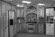</td>
<td bgcolor=LightGreen></td>
<td bgcolor=LightGreen></td>
<td bgcolor=LightCoral> <small>LivingRoom</small></td>
<td bgcolor=LightCoral> <small>Bedroom</small></td>
<td bgcolor=#FFBB55> <small>TallBuilding</small></td>
<td bgcolor=#FFBB55>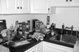 <small>Bedroom</small></td>
</tr>
<tr>
<td>Store</td>
<td>0.510</td>
<td bgcolor=LightBlue></td>
<td bgcolor=LightBlue></td>
<td bgcolor=LightGreen></td>
<td bgcolor=LightGreen></td>
<td bgcolor=LightCoral> <small>InsideCity</small></td>
<td bgcolor=LightCoral> <small>LivingRoom</small></td>
<td bgcolor=#FFBB55> <small>Office</small></td>
<td bgcolor=#FFBB55> <small>Office</small></td>
</tr>
<tr>
<td>Bedroom</td>
<td>0.460</td>
<td bgcolor=LightBlue></td>
<td bgcolor=LightBlue></td>
<td bgcolor=LightGreen>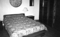</td>
<td bgcolor=LightGreen>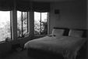</td>
<td bgcolor=LightCoral> <small>Office</small></td>
<td bgcolor=LightCoral> <small>LivingRoom</small></td>
<td bgcolor=#FFBB55> <small>Office</small></td>
<td bgcolor=#FFBB55>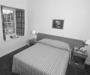 <small>Mountain</small></td>
</tr>
<tr>
<td>LivingRoom</td>
<td>0.430</td>
<td bgcolor=LightBlue></td>
<td bgcolor=LightBlue></td>
<td bgcolor=LightGreen></td>
<td bgcolor=LightGreen></td>
<td bgcolor=LightCoral>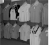 <small>Store</small></td>
<td bgcolor=LightCoral> <small>Bedroom</small></td>
<td bgcolor=#FFBB55> <small>Industrial</small></td>
<td bgcolor=#FFBB55> <small>Industrial</small></td>
</tr>
<tr>
<td>Office</td>
<td>0.780</td>
<td bgcolor=LightBlue></td>
<td bgcolor=LightBlue></td>
<td bgcolor=LightGreen></td>
<td bgcolor=LightGreen></td>
<td bgcolor=LightCoral> <small>Bedroom</small></td>
<td bgcolor=LightCoral> <small>Store</small></td>
<td bgcolor=#FFBB55> <small>Bedroom</small></td>
<td bgcolor=#FFBB55>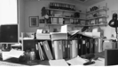 <small>Bedroom</small></td>
</tr>
<tr>
<td>Industrial</td>
<td>0.380</td>
<td bgcolor=LightBlue></td>
<td bgcolor=LightBlue></td>
<td bgcolor=LightGreen></td>
<td bgcolor=LightGreen></td>
<td bgcolor=LightCoral>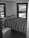 <small>Bedroom</small></td>
<td bgcolor=LightCoral> <small>Street</small></td>
<td bgcolor=#FFBB55> <small>Bedroom</small></td>
<td bgcolor=#FFBB55> <small>TallBuilding</small></td>
</tr>
<tr>
<td>Suburb</td>
<td>0.900</td>
<td bgcolor=LightBlue>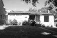</td>
<td bgcolor=LightBlue></td>
<td bgcolor=LightGreen>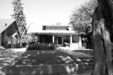</td>
<td bgcolor=LightGreen>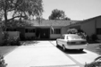</td>
<td bgcolor=LightCoral> <small>InsideCity</small></td>
<td bgcolor=LightCoral>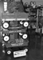 <small>Store</small></td>
<td bgcolor=#FFBB55> <small>LivingRoom</small></td>
<td bgcolor=#FFBB55> <small>OpenCountry</small></td>
</tr>
<tr>
<td>InsideCity</td>
<td>0.540</td>
<td bgcolor=LightBlue></td>
<td bgcolor=LightBlue></td>
<td bgcolor=LightGreen></td>
<td bgcolor=LightGreen></td>
<td bgcolor=LightCoral> <small>TallBuilding</small></td>
<td bgcolor=LightCoral> <small>Store</small></td>
<td bgcolor=#FFBB55> <small>Office</small></td>
<td bgcolor=#FFBB55> <small>Office</small></td>
</tr>
<tr>
<td>TallBuilding</td>
<td>0.740</td>
<td bgcolor=LightBlue></td>
<td bgcolor=LightBlue></td>
<td bgcolor=LightGreen></td>
<td bgcolor=LightGreen></td>
<td bgcolor=LightCoral> <small>OpenCountry</small></td>
<td bgcolor=LightCoral> <small>InsideCity</small></td>
<td bgcolor=#FFBB55> <small>Coast</small></td>
<td bgcolor=#FFBB55> <small>Forest</small></td>
</tr>
<tr>
<td>Street</td>
<td>0.750</td>
<td bgcolor=LightBlue></td>
<td bgcolor=LightBlue></td>
<td bgcolor=LightGreen></td>
<td bgcolor=LightGreen></td>
<td bgcolor=LightCoral> <small>OpenCountry</small></td>
<td bgcolor=LightCoral> <small>Kitchen</small></td>
<td bgcolor=#FFBB55> <small>TallBuilding</small></td>
<td bgcolor=#FFBB55> <small>TallBuilding</small></td>
</tr>
<tr>
<td>Highway</td>
<td>0.810</td>
<td bgcolor=LightBlue></td>
<td bgcolor=LightBlue></td>
<td bgcolor=LightGreen></td>
<td bgcolor=LightGreen></td>
<td bgcolor=LightCoral> <small>Coast</small></td>
<td bgcolor=LightCoral> <small>Store</small></td>
<td bgcolor=#FFBB55> <small>Coast</small></td>
<td bgcolor=#FFBB55> <small>TallBuilding</small></td>
</tr>
<tr>
<td>OpenCountry</td>
<td>0.540</td>
<td bgcolor=LightBlue></td>
<td bgcolor=LightBlue></td>
<td bgcolor=LightGreen></td>
<td bgcolor=LightGreen></td>
<td bgcolor=LightCoral> <small>Highway</small></td>
<td bgcolor=LightCoral> <small>Industrial</small></td>
<td bgcolor=#FFBB55> <small>Coast</small></td>
<td bgcolor=#FFBB55> <small>Coast</small></td>
</tr>
<tr>
<td>Coast</td>
<td>0.820</td>
<td bgcolor=LightBlue></td>
<td bgcolor=LightBlue></td>
<td bgcolor=LightGreen></td>
<td bgcolor=LightGreen></td>
<td bgcolor=LightCoral>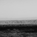 <small>OpenCountry</small></td>
<td bgcolor=LightCoral> <small>OpenCountry</small></td>
<td bgcolor=#FFBB55> <small>OpenCountry</small></td>
<td bgcolor=#FFBB55> <small>OpenCountry</small></td>
</tr>
<tr>
<td>Mountain</td>
<td>0.800</td>
<td bgcolor=LightBlue></td>
<td bgcolor=LightBlue></td>
<td bgcolor=LightGreen></td>
<td bgcolor=LightGreen></td>
<td bgcolor=LightCoral> <small>Kitchen</small></td>
<td bgcolor=LightCoral>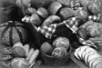 <small>Store</small></td>
<td bgcolor=#FFBB55> <small>Suburb</small></td>
<td bgcolor=#FFBB55> <small>Coast</small></td>
</tr>
<tr>
<td>Forest</td>
<td>0.960</td>
<td bgcolor=LightBlue></td>
<td bgcolor=LightBlue></td>
<td bgcolor=LightGreen></td>
<td bgcolor=LightGreen></td>
<td bgcolor=LightCoral> <small>Store</small></td>
<td bgcolor=LightCoral> <small>OpenCountry</small></td>
<td bgcolor=#FFBB55> <small>Mountain</small></td>
<td bgcolor=#FFBB55> <small>Mountain</small></td>
</tr>
<tr>
<th>Category name</th>
<th>Accuracy</th>
<th colspan=2>Sample training images</th>
<th colspan=2>Sample true positives</th>
<th colspan=2>False positives with true label</th>
<th colspan=2>False negatives with wrong predicted label</th>
</tr>
</table>

</body>
</html>
